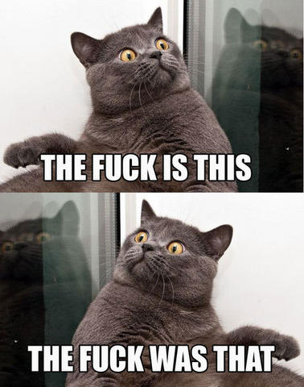
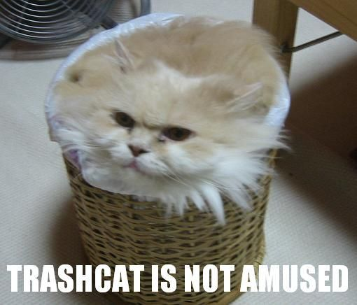

!SLIDE 
# Erlang and Batman.js #
## Tristan Sloughter (tristan@mashape.com @t_sloughter)

!SLIDE bullets 
# Contents #

* Types of Web Frameworks
* Javscript Frameworks
* Erlang for RESTful API

!SLIDE center
# Cowboy-Batman! #

!SLIDE bullets 
#  Why My Way? #

* Right tool for the job
* API from the beginning 
* Total separation

!SLIDE bullets 
# Frameworks #

* Rails, Django, Play!, Chicago Boss...
* Lift, Yesod, Nitrogen...
* Opa, Meteor...

!SLIDE center
# Me Using Rails #

!SLIDE center
# Erlang for Web Development? #

!SLIDE center
# I know, I'll convert Erlang terms to HTML and have functions to generate Javascript! #

!SLIDE center
# Now you have 2 problems! #

!SLIDE center
# Throw it all away #

!SLIDE center
# Simplify! #

!SLIDE center
# Browser \<- JSON -> Backend #

!SLIDE center

!SLIDE execute
# Nginx Config #
    @@@ Javascript
    server {
     listen 80;
     server_name localhost;
    
     location / {
      root .../bcmvc/lib/bcmvc_web/priv/;
    
      if ($request_method ~* POST) {
        proxy_pass http://localhost:8080;
      }
    
      if ($http_accept ~* application/json) {
        proxy_pass http://localhost:8080;
      }
     }
    }
